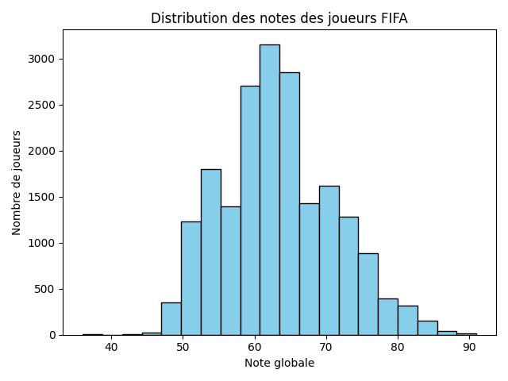
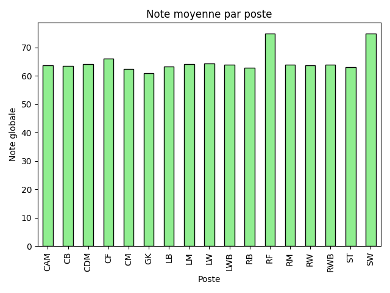
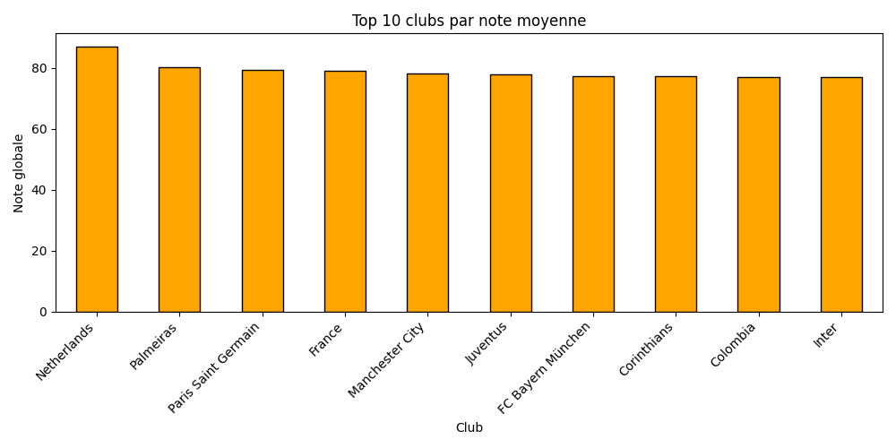
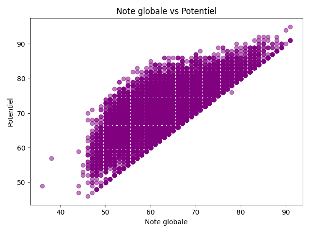
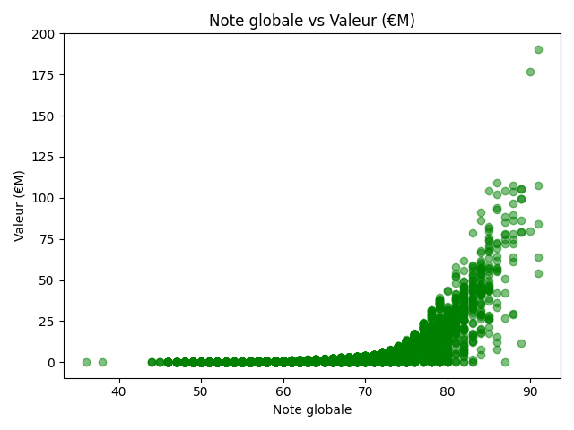
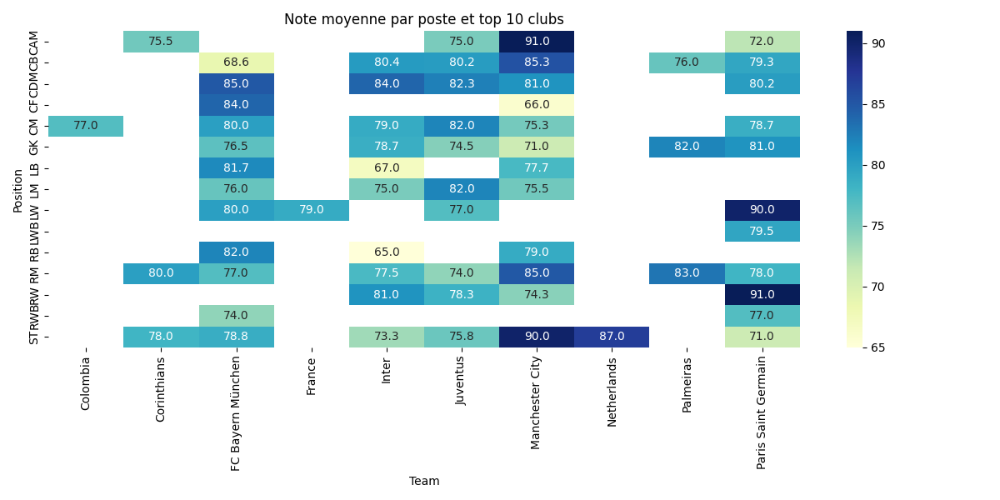
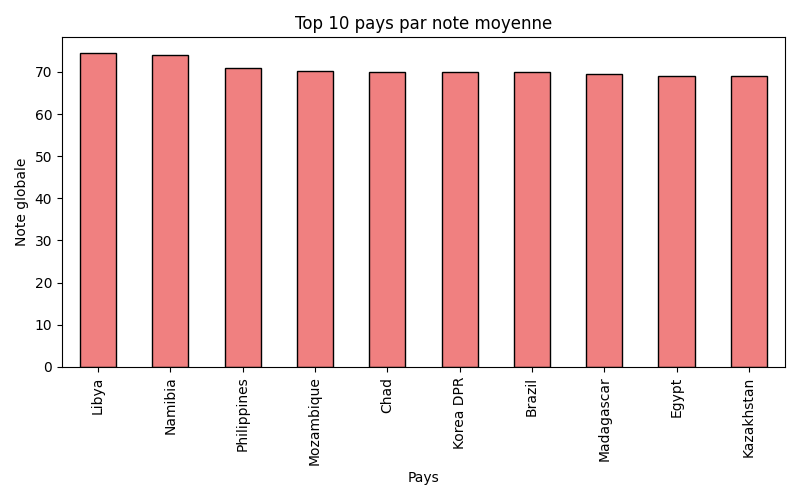

# Projet FIFA – Analyse des joueurs

## Description
Analyse des joueurs de FIFA à partir d’un dataset public.  
Objectifs :
- Identifier les top 10 joueurs par note globale.
- Calculer les moyennes par poste, club et pays.
- Visualiser les données avec des graphiques (bar chart, scatter, heatmap).
- Extraire des insights sur les joueurs, clubs et nations.

## Dataset
- Source : [SoFIFA](https://sofifa.com/)  
- Colonnes principales :
  - `Name`, `Country`, `Position`, `Age`, `Overall_Rating`, `Potential`, `Team`, `Value € M`, `Wage € K`, `Total_Stats`

## Analyse réalisée

### Top 10 joueurs
- Les 10 meilleurs joueurs du dataset selon la note globale.

### Moyennes
- Moyenne par poste, club et pays.
- Top 10 clubs et pays sont affichés pour plus de clarté.

### Graphiques

  
*Distribution des notes globales des joueurs FIFA.*

  
*Note moyenne par poste.*

  
*Top 10 clubs par note moyenne.*

  
*Note globale vs potentiel des joueurs.*

  
*Note globale vs valeur marchande.*

  
*Note moyenne par poste et par club (top 10 clubs).*

  
*Top 10 pays par note moyenne.*

### Insights
- Les attaquants ont en moyenne une note plus élevée que les défenseurs.  
- Les clubs et pays ont des notes globales très variables.  
- La majorité des joueurs se situe entre 65 et 75 en note globale.  
- Certains joueurs ont un potentiel très élevé malgré une note actuelle moyenne.

## Scripts
- `analyse_fifa.py` → script d’analyse et génération des graphiques.  
- `fifa.csv` → dataset des joueurs.

## Organisation du projet
Voici la structure des fichiers du projet, pour savoir où trouver le script, le dataset et les images générées :

fifa_project/
│
├── analyse_fifa.py          # Script Python pour l'analyse et les graphiques
├── fifa.csv                 # Dataset des joueurs FIFA 
└── images/                  # Dossier contenant tous les graphiques générés
     ├── histogram_notes.png
     ├── bar_position.png
     ├── bar_top10_clubs.png
     ├── scatter_rating_potential.png
     ├── scatter_rating_value.png
     ├── heatmap_poste_club.png
     └── bar_top10_pays.png
     
